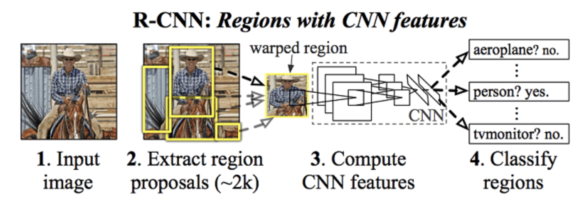
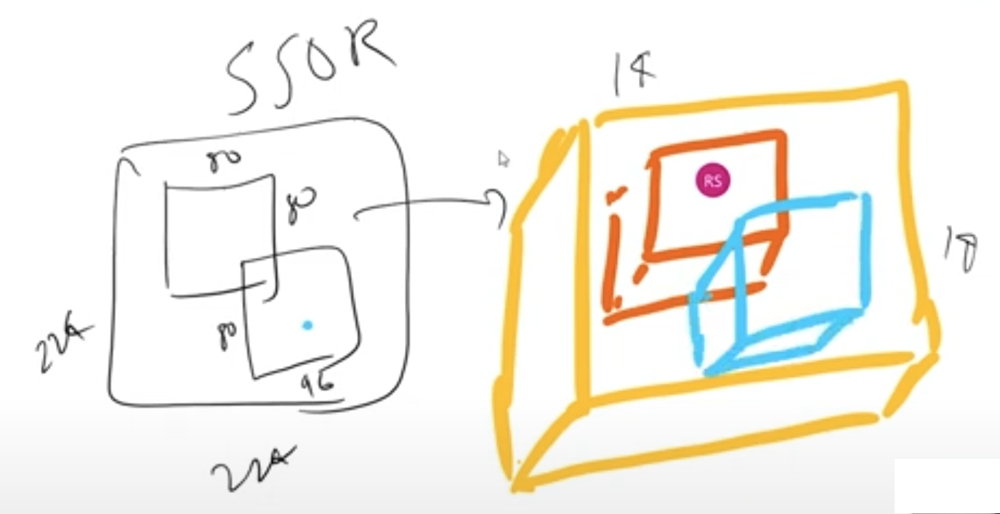
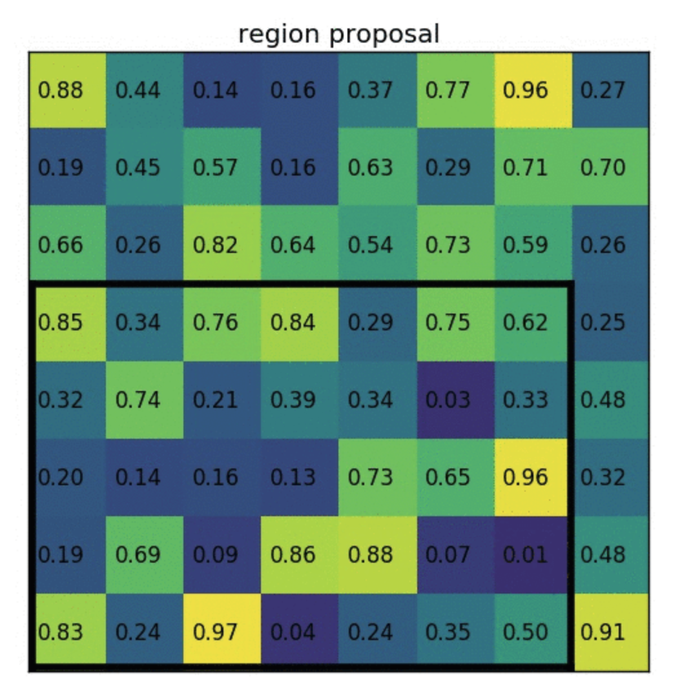
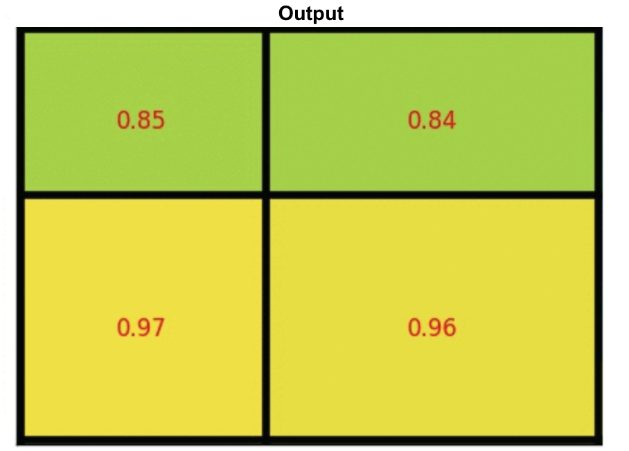
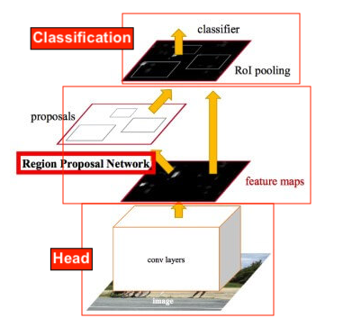

# Understanding RCNN models and its variants

* The story of RCNN actually starts from this paper: [Selective Search for Object Recognition. ](https://ivi.fnwi.uva.nl/isis/publications/2013/UijlingsIJCV2013/UijlingsIJCV2013.pdf)SSOR addresses the problem of generating possible object locations for use in object recognition. In turn, SSOR depends on [Efficient Graph-based Image Segmentation](http://people.cs.uchicago.edu/~pff/papers/seg-ijcv.pdf) to find it's first proposals. This uses Computer Vision and not AI for segmentation, basically splitting the color channels

* **RCNN**: Manually segmented images into multiple region proposals (using CV algorithms) and then passed each proposal through AlexNET and then merge the segmented images. So for each image, AlexNET was run 2000 times! Also, The selective search algorithm is a fixed algorithm. Therefore, no learning
  is happening at that stage. This could lead to the generation of bad candidate region proposals.

* **Fast RCNN**: Optimized RCNN by not passing Region proposals to AlexNet 2000 times, but rather just one time. Here we just have to figure out to map proposed region to convolved output
  
  

  * The network first processes the whole image with several convolutional (conv) and max pooling layers to produce a conv feature map.
  
* Then, for each object proposal a region of interest (RoI) pooling layer extracts a fixed-length feature vector from the feature map (7x7). This is done because later we are converting 2D to 1D (FC layers) and 1D expects fixed size of input. Hence we convert the conv ROI input to fixed dim 7x7.
  * Each feature vector is fed into a sequence of fully connected (fc) layers that finally branch into two sibling output layers:

    - one that produces softmax probability estimates over K object classes plus a catch-all “background” class and
  - another layer that outputs four real-valued numbers for each of the K object classes. Each set of 4 values encodes refined bounding-box positions for one of the K classes.
  * The **RoI** Pooling layer uses maxpooling to convert the features inside any valid region of interest into a small feature map with resolution of 7x7. 
    
  
* So, above we see that input image is fed to conv net and then we get ROI from the proposal method (in this case it is SSOR), ROI pooling is done to make feature maps of resolution 7x7. Then FCs predicts two outputs. One is the class prediction and another one is the adjustments. Adjustments are nothing but adjustments to be done to original proposal.
  * ROI Pooling: Divide the ROI in such a way that we get final dimensions and then max pool in those divided blocks
     
   
    
  
* To increase resolution to 7x7 say from 4x3, then we just to interpolation i.e. 4x3 -> interpolated to -> 8x6, but we because we need 7x7, just repeat last column to get 8x7, then perform ROI pooling
  * Above shows one example of a region proposal made by SSOR. But actual bounding boxes are not always well alligned, like shown below. Proposed bbox might be the dotted lines. This scaled to the closest edge and then we get well aligned bbox. Obviously this introduces more errors and that will be solved later
    
  * Also, above division of boxes can be done the way we like i.e. first box is 2x3, it could've been 3x3, etc. Fix the method and then train the model
  
* **Faster RCNN**:
  
  * Fast RCNN uses SSOR (internally uses EGIS), which has its problems, here it is fixed by using a neural network to predict these region proposals. This is RPN (Region Proposal Network)
  
  * So the network will predict classes and since the network has learnt in its layers Edges/Gradients/Textures/Patterns, same can be used for RPN. Hence we branch out the network to predict RPs and then merge it back after few convolutions to get classes & boxes
  
  * Here RPN itself can predict the class as it knows the object. So RPN's output is the region proposal and the objectness. Infact it doesn't just say if the obj is present or not. It gives two output:
  
    | Foreground (object) | Background (object's background) | Note |
    | ------ | ----- | ------------- |
    | 0 | 0 | Ignore |
    | 0 | 1 | Allow |
    | 1| 0 | Allow |
    | 1 | 1 | Punish! |
    
  * RPN:
  
    * First the picture goes through conv layers and feature maps are extracted
    * Then a sliding window is used in RPN for each location over the feature map. Here sliding window means going through each block of final conv i.e. say in Yolo we had 13x13 divisions, so going through each block from 169 blocks (13x13) is called sliding window. In YoloV2, we only go through on network, but here it is different. Here we first get objectness (i.e. Fb/Bg), x,y,h,w (region proposal bbox, not final bbox). Then through another network we get classes & final bbox
    * Unlike YoloV2 where our final feature map is 13x13, here it is based on input size. But we stop at the scale of 16 i.e. if input size is 1024, then our final feature map size will be 64x64.
    * Here in the feature maps we'll have 9 anchor boxes per block. In YoloV2, we had 5 anchor boxes. Also anchor boxes are not found using K-means, instead they have fixed anchor boxes
    * For each location, 9 anchor boxes are used (3 scales of 128, 256 and 512, and 3 aspect ratios of 1:1, 1:2 and 2:1) for generating region proposals. This means we have the following anchor boxes:
		| Scales | Aspect Ratios | Anchor box |
    | ------ | ----- | ------------- |
    | 128 | 1:1 | 128x128 |
    |  | 2:1 | 256x128 |
    | | 1:2 | 128x256 |
    | 256 | 1:1 | 256x256 |
    |  | 2:1 | 512x256 |
    | | 1:2 | 256x512 |
    | 512 | 1:1 | 512x512 |
    |  | 2:1 | 1024x512 |
    | | 1:2 | 512x1024 |
    * A **cls** layer outputs **2x**9 scores whether is object or not for 9 anchors. 
    * A **reg** layer outputs 4x9 scores for coordinates for 9 anchor boxes.
    * So if we compare YoloV2 with this network, we can understand this better:
		|  | YoloV2 | RPN |
    | ------ | ----- | ------------- |
    | Anchor Boxes | 5 | 9 |
    | Technique to find anchor box | KMeans | Ratios |
    | Prediction Output | Objectness (1value per anchor box) | Objectness (2[fg/bg] per anchor box) |
    || x,y,h,w (4 values per anchor box) | Dx,Dy,Dh,Dw (4 values per anchor box), this is region proposals (not final box). It is deltas and not actual value. So Dx,Dy is how much anchor box center. Dh,Dw is how much of anchor box to crop |
    || class predictions | no class predictions |
    * With a size of WxH feature map, there are WH9 anchors in total. This means, we can have W != H.
    * We then feed the region proposals to the RoI layer of the Fast R-CNN.
      
    * Faster RCNN (or others) have three main types of networks:
      * Head (say ResNet50 etc)
      * Region Proposal Network
      * Classification Network
    * Software flow:
      
    * **Anchor Generation Layer:** This layer generates a fixed number of “anchors” (bounding boxes) by first generating 9 anchors of different scales and aspect ratios and then replicating these anchors by translating them across uniformly spaced grid points spanning the input image.
    * **Proposal Layer:** Transform the anchors according to the bounding box regression coefficients to generate transformed anchors. Then prune the number of anchors by applying non-maximum suppression (see Appendix) using the probability of an anchor being a foreground region
    * **Anchor Target Layer**: The goal of the anchor target layer is to produce a set of “good” anchors and the corresponding foreground/background labels and target regression coefficients to train the Region Proposal Network. The output of this layer is only used to train the RPN network and is not used by the classification layer. Given a set of anchors (produced by the anchor generation layer, the anchor target layer identifies promising foreground and background anchors. Promising foreground anchors are those whose overlap with some ground truth box is higher than a threshold. Background boxes are those whose overlap with any ground truth box is lower than a threshold. The anchor target layer also outputs a set of bounding box regressors i.e., a measure of how far each anchor target is from the closest bounding box. These regressors only make sense for the foreground boxes as there is no notion of “closest bounding box” for a background box.
    * **RPN Loss:** The RPN loss function is the metric that is minimized during optimization to train the RPN network. The loss function is a combination of:
      - The proportion of bounding boxes produced by RPN that are correctly classified as foreground/background
      - Some distance measure between the predicted and target regression coefficients.
    * **Proposal Target Layer:** The goal of the proposal target layer is to prune the list of anchors produced by the proposal layer and produce *class specific* bounding box regression targets that can be used to train the classification layer to produce good class labels and regression targets
    * **ROI Pooling Layer:** Implements a spatial transformation network that samples the input feature map given the bounding box coordinates of the region proposals produced by the proposal target layer. These coordinates will generally not lie on integer boundaries, thus interpolation based sampling is required.
    * **Classification Layer:** The classification layer takes the output feature maps produced by the ROI Pooling Layer and passes them through a series of convolutional layers. The output is fed through two fully connected layers. The first layer produces the class probability distribution for each region proposal and the second layer produces a set of class specific bounding box regressors.
    * **Classification Loss:** Similar to RPN loss, classification loss is the metric that is minimized during optimization to train the classification network. During back propagation, the error gradients flow to the RPN network as well, so training the classification layer modifies the weights of the RPN network as well. We’ll have more to say about this point later. The classification loss is a combination of:
      * The proportion of bounding boxes produced by RPN that are correctly classified (as the correct object class)
      * Some distance measure between the predicted and target regression coefficients.
    * We saw above in our comparison table that we predict delta values. Why? We can that by understanding what **Anchor Generation Layer** does
      * The anchor generation layer produces a set of bounding boxes (called “anchor boxes”) of varying sizes and aspect ratios spread all over the input image. These bounding boxes are the same for all images i.e., they are agnostic of the content of an image. Some of these bounding boxes will enclose foreground objects while most won’t. The goal of the RPN network is to learn to identify which of these boxes are good boxes – i.e., likely to contain a foreground object and to produce target regression coefficients, which when applied to an anchor box turns the anchor box into a better bounding box (fits the enclosed foreground object more closely).
      * Our objective is to find bounding boxes in the image. These have rectangular shape and can come in different sizes and aspect ratios. Imagine we were trying to solve the problem knowing beforehand that there are two objects on the image. The first idea that comes to mind is to train a network that returns 8 values: **two xmin, ymin, xmax, ymax**
        **​​tuples** defining a bounding box for each object.
      * This approach has some fundamental problems. For example, images may have different sizes and aspect ratios, having a good model trained to predict raw coordinates can turn out to be very complicated (if not impossible). Another problem is invalid predictions: when predicting xmin and xmax we have to somehow enforce that xmin < xmax.
      * It turns out that there is a simpler approach to predicting bounding boxes by learning to predict offsets from reference boxes. We take a reference box xcenter, ycenter, width, height and learn to predict Δ x_center, Δy_center, Δwidth, Δheight  , which are usually small values that tweak the reference box to better fit what we want.
      * The diagram below demonstrates how these anchor boxes are generated.
    * The region proposal layer has two goals:
      - From a list of anchors, identify background and foreground anchors
      - Modify the position, width and height of the anchors by applying a set of “regression coefficients” to **improve the quality of the anchors** (for example, make them fit the boundaries of objects better)
      - The region proposal layer consists of a Region Proposal *Network* and three layers:
        - Proposal Layer
        - Anchor Target Layer and
        - Proposal Target Layer.
    * RPN Diagram:
      
    
  * Details about each layer & loss:
    
    * The region proposal layer runs feature maps produced by the head network through a convolutional layer (called rpn_net in code) followed by RELU. The output of rpn_net is run through two (1,1) kernel convolutional layers to produce background/foreground class scores and probabilities and corresponding bounding box regression coefficients. The stride length of the head network matches the stride used while generating the anchors, so the number of anchor boxes are in 1-1 correspondence with the information produced by the region proposal network
    * (number of anchor boxes = number of class scores = number of bounding box regression coefficients = )
    * The proposal layer takes the anchor boxes produced by the anchor generation layer and prunes the number of boxes by applying non-maximum suppression based on the foreground scores (see appendix for details). It also generates transformed bounding boxes by applying the regression coefficients generated by the RPN to the corresponding anchor boxes.
    * The goal of the anchor target layer is to select promising anchors that can be used to train the RPN network to:
      - distinguish between foreground and background regions and
      - generate good bounding box regression coefficients for the foreground boxes.
    * It is useful to first look at how the RPN Loss is calculated. This will reveal the information needed to calculate the RPN loss which makes it easy to follow the operation of the Anchor Target Layer. To do generate good bboxes from a set of anchor boxes, the RPN layer must learn to classify an anchor box as background or foreground and calculate the regression coefficients to modify the position, width and height of a foreground anchor box to make it a “better” foreground box (fit a foreground object more closely). RPN Loss is formulated in such a way to encourage the network to learn this behaviour.
    * RPN loss is a sum of the classification loss and bounding box regression loss. The classification loss uses cross entropy loss to penalize incorrectly classified boxes and the regression loss uses a function of the distance between the true regression coefficients (calculated using the closest matching ground truth box for a foreground anchor box) and the regression coefficients predicted by the network (see rpn_bbx_pred_net in the RPN network architecture diagram).
    * The feature vector is then passed through two fully connected layers – bbox_pred_net and cls_score_net. The cls_score_net layer produces the class scores for each bounding box (which can be converted into probabilities by applying softmax). The bbox_pred_net layer produces the class specific bounding box regression coefficients which are combined with the original bounding box coordinates produced by the proposal target layer to produce the final bounding boxes.
    
  * In Summary:
    
  
    * Faster R-CNN uses a CNN feature extractor to extract image features. Then it uses a CNN region proposal network to create region of interests (RoIs). We apply RoI pooling to warp them into fixed dimension. It is then feed into fully connected layers to make classification and boundary box prediction.
  
* **Mask R-CNN**

  * The Faster R-CNN builds all the ground works for feature extractions and ROI proposals. At first sight, performing image segmentation may require more detail analysis to colorize the image segments. By surprise, not only we can piggyback on this model, the extra work required is pretty simple. After the ROI pooling, we add 2 more convolution layers to build the mask.
    

  * Example conv flow: Say input is 7x7x2048 and we need mask as 7x7x3 (say we have 3 classes), then we can just have two convs of 3x3x512 & 3x3x3. So mask output is divided into fixed blocks (like YoloV2), and mask of each class is a separate dim. So if there are 15 classes, then the output will be 7x7x15

  * Infact we can even add another branch like how we did for mask to predict pose.

  * ROI Align:

    * Another major contribution of Mask R-CNN is the refinement of the ROI pooling. In ROI, the warping is digitalized (top left diagram below): the cell boundaries of the target feature map are forced to realign with the boundary of the input feature maps.

    * Therefore, each target cells may not be in the same size (bottom left diagram). Mask R-CNN uses **ROI Align** which does not digitalize the boundary of the cells (top right) and make every target cell to have the same size (bottom right).

    * It also applies interpolation to calculate the feature map values within the cell better. For example, by applying interpolation, the maximum feature value on the top left is changed from 0.8 to 0.88 now.

      

    * A detailed explanation on ROI pooling can be found [here](https://towardsdatascience.com/understanding-region-of-interest-part-2-roi-align-and-roi-warp-f795196fc193)

    * ROI Align makes significant improvements in the accuracy

