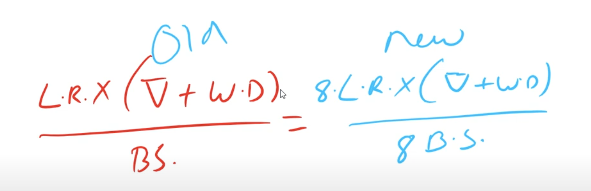
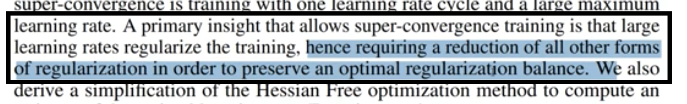
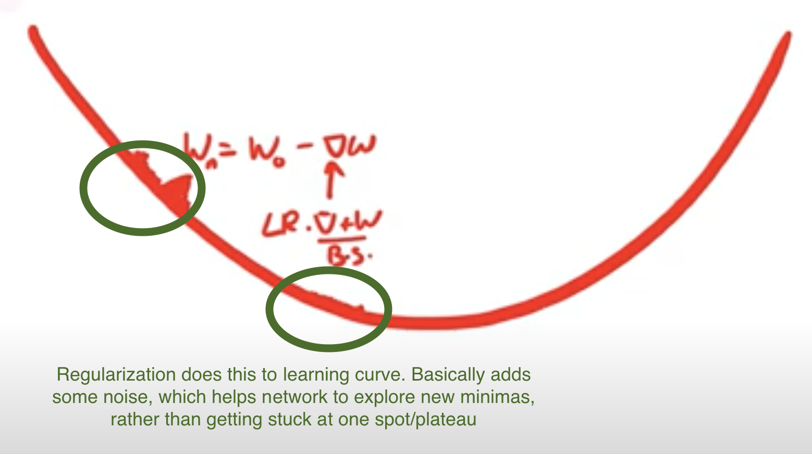
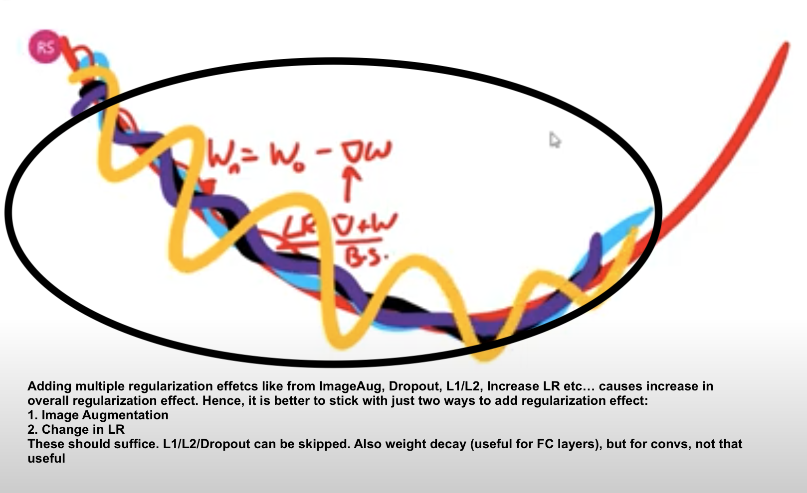
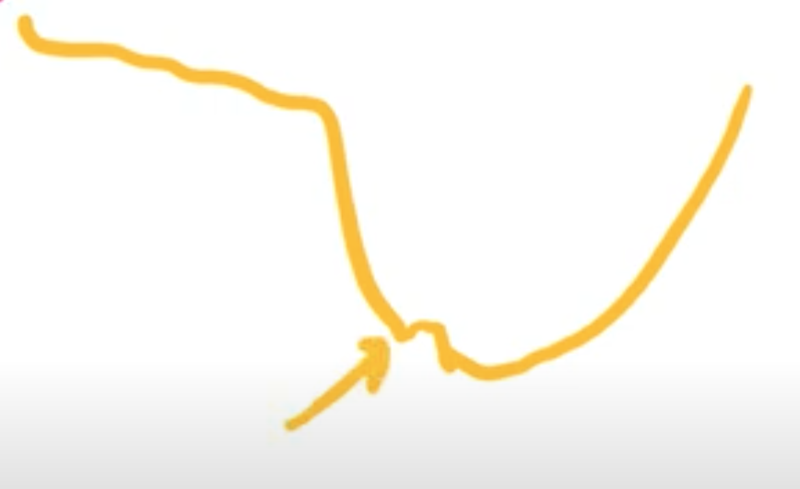
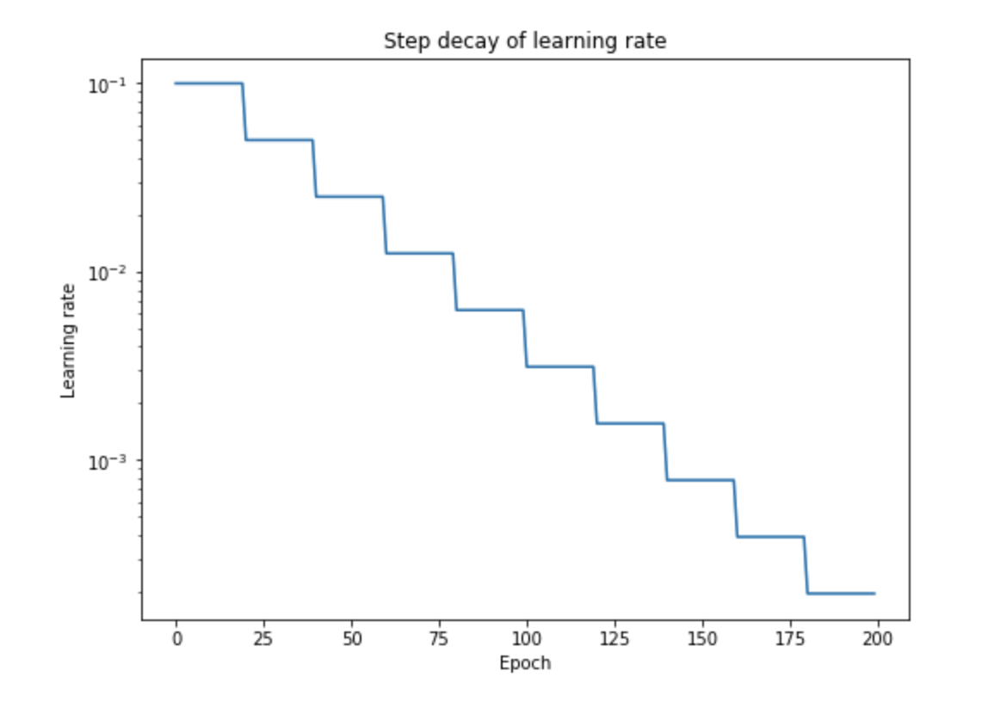
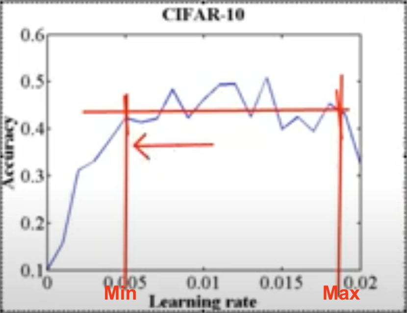
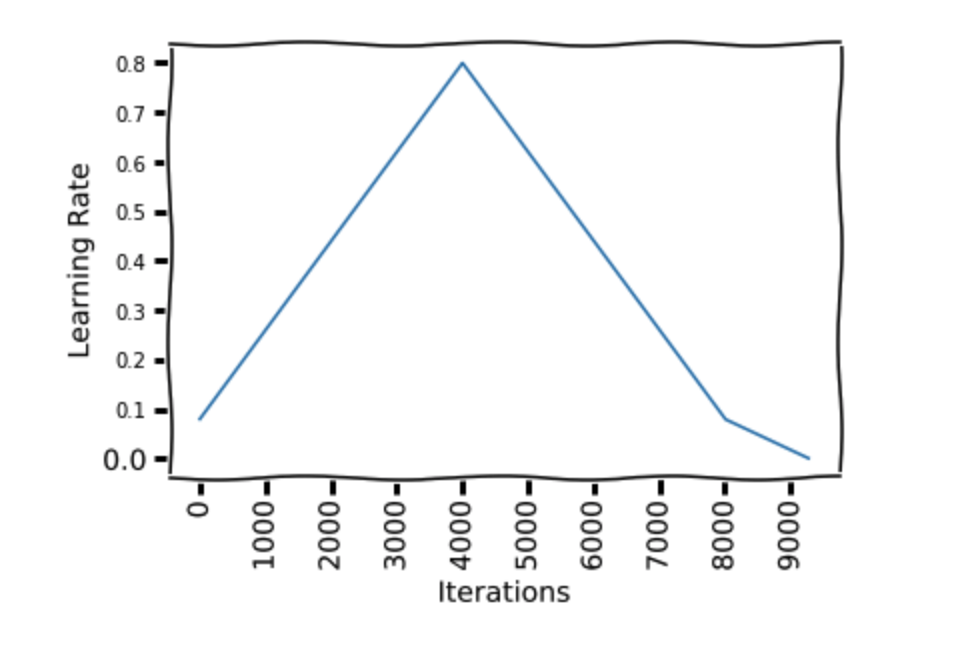
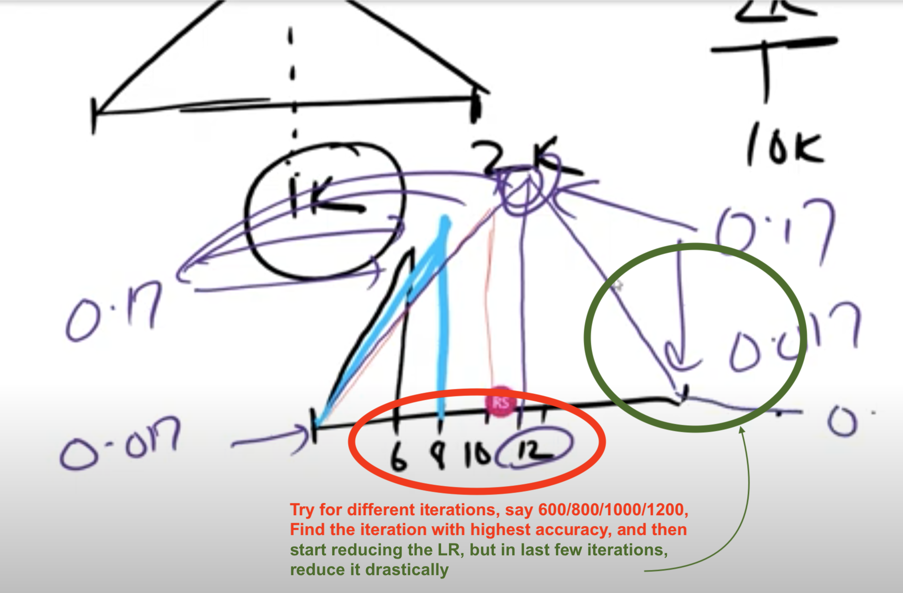

# Achieving SuperConvergence

##### General Notes

* LR points:

  * Our loss function is somewhat like the following:

    

  * LR is multiplied by the gradient weight update & the weight decay averages over batch size. But say we move from Colab to AWS GPU (where we have higher GPUs), then our batch size will increase (say 8 times). Then we should make sure that LR is also increased respectively such that above equality is maintained.

* Image Augmentation:

  * The main reason we do image aug is to mimic real world dataset, increasing accuracy, regularization etc are all outcome of image aug
  * You can use Blender. Look at blendswap, chocofur etc.

* Plateus: L1/L2 regularization doesn't help with plateaus. Gradient perturbation, dropout, patch guassian does help

* To look at SOTA model of different dataset look at "paperswithcode benchmarks"

##### [Very Fast Training of Neural Networks using Large Learning Rates](https://arxiv.org/pdf/1708.07120.pdf)

* [Abstract]: In this paper, we describe a phenomenon, which we called "super-convergence", here **neural** **networks can be trained an order of magnitude faster** than with standard training methods. The existence of super-convergence is relevant to understanding why deep networks generalize well. 
  

* As per paper, large learning rates gives regularization effects during training!

  
  

#### Evolution of OCP (One-Cycle-Policy) from Simple LR

* In previous session (LR Finder), we found the best LR by doing the following:

  * Try range of LRs for a number of iterations
  * Plot LR vs Loss graph
  * The best LR is where we see **steepest reduction in loss**. 

  

* Selecting a good starting learning rate is merely the first step. In order to efficiently train a robust model, we will need to gradually decrease the learning rate during training. If the learning rate remains unchanged during the course of training, it might be too large to converge and cause the loss function to fluctuate around the local minimum. The approach is to use a higher learning rate to quickly reach the regions of (local) minima during the initial training stage, and set a smaller learning rate as training progresses in order to explore **“deeper and more thoroughly”** in the region to find the minimum.

* **Piecewise Constant**:
  
  
  * Benefits: As we have discussed through our variable value example, say a variable needs to be at 0.3456789. 
  
    But if our updates are governed by , and it can only go as low as some multiple of 0.001, 
  
    then we can only achieve **0.345**. For us to achieve the remaining 0.000**6789**, we need to reduce
  
    the magnitude order of updates by 1 decimal unit every time. In Piecewise constant we reduce the learning rate gradually, keep it constant for a few epochs. Normally, you'd see magnitude drop by 10 every 25-50 epoch.
  
  * Problem: We don't know when to change the LR. Have to use Hyper-parameter Grid Search to find that. One will need extraordinary resources to do this, and this isn't practical, except outside academia or large MNCs
  
* **Reduce LR on Plateau**: Simpler solution to above problem. But then they are not yet easy to pick by the way. For example, you really need to understand the difference between **rel** vs **abs** threshold_mode. So in a way, we'll have to do grid search here to experiment with different parameters 

* **Warm-Up Strategies**: Our variables are initialized randomly, shouldn't we give the network some time to "warm-up" and "align" the variables in the right direction before we actually train them? Different approaches:

  * **Constant warmup**: In constant warm up, you train the model with a small learning rate for few epochs (say 5 epochs -> again grid search to get this number!) and then increase the learning rate to “k times learning rate”. However, this approach causes a spike in the training error when the learning rate is changed.

  * **Gradual warmup**: As the name suggests, you start with a small learning rate and then gradually increase it by a constant for each epoch till it reaches “k times learning rate”. This approach helps the model to perform better with huge batch sizes (8k in this example) , which is in par with the training error of the model trained with smaller batches.

  * **CLR (Cyclic LR)**: The essence of the learning rate policy comes from the observation that **increasing the LR** might have a **short term negative effect** and yet achieve a **longer-term beneficial effect**. This observation leads to the idea of letting the LR vary within a range of values rather than adopting a stepwise fixed or exponentially decreasing value.

    * Short-term negative effect: During initialization, some points might be closer to their optimal value, but if we increase the LR by a large value, then they might displace to a value far from the optimal value
    * Longer-term beneficial effect: But displacing from an optimal value could be that we just moved it from one local minima to another better minima. i.e. we want the values to be in a minima, where slight changes (change in dataset), doesn't make network perform bad:
      
      * Increasing the learning rate will force the model to jump to a different part of the weight space if the current area is “spikey”. It is better to avoid spikey area, because although we might good accuracy there, it won't be Robust! Ideal minima is the second image (with big mouth)

  * **One Cycle Policy (OCP)**: In the paper “[A disciplined approach to neural network hyper-parameters: Part 1 — learning rate, batch size, momentum, and weight decay ](https://arxiv.org/abs/1803.09820)” , Leslie Smith describes the approach to set hyper-parameters (namely learning rate, momentum and weight decay) and batch size. In particular, he suggests 1 Cycle policy to apply learning rates.

    * Before looking at OCP, one must under LR range test to find min & max LRs. Basically, plot LR against accuracy (i.e. train with increasing LR) and find a range from the plot where you think accuracy is pretty consistent:
      

    * Now coming back to OCP: The author recommends doing one cycle of learning rate of 2 steps of **equal length** (actually not equal, as we reduce LR significantly in last few epochs). We choose the maximum learning rate using a range test. We use a lower learning rate as 1/5th or 1/10th of the maximum learning rate (Rohan usually uses 1/8, also not getting min from graph like above). We go from a lower learning rate to a higher learning rate in step 1 and back to a lower learning rate in step 2. We pick this cycle length slightly lesser than the total number of epochs to be trained. And in the last remaining iterations, we annihilate the learning rate way below the lower learning rate value(1/10 th or 1/100 th).
      

    * The motivation behind this is that, during the middle of learning when the learning rate is higher, the learning rate works as a regularisation method and keep the network from overfitting. This helps the network to avoid steep areas of loss and land better flatter minima.

    * As in the figure, We start at a learning rate 0.08 and make a step of 41 epochs to reach a learning rate of 0.8, then make another step of 41 epochs where we go back to a learning rate 0.08. Then we make another 13 epochs to reach 1/10th of lower learning rate bound(0.08).

    * How do we know at which iteration we should have the peak? Also how long to train the network?

      * This will come up as intuition. But we'll see that we can train our network very very fast! Maybe in just, say, 4 epochs. 2k to 10k is a good iteration to work with. We can just start with 2k. But what about the peak, should it be at 1k? -> No, originally it was proposed to be in middle, but now it has changed:

        

    * Momentum and learning rate are closely related. It can be seen in the weight update equation for SGD that the momentum has a similar impact as the learning rate on weight updates. The author found in their experiments that reducing the momentum when the learning rate is increasing gives better results. This supports the intuition that in that part of the training, we want the SGD to quickly go in new directions to find a better minima, so the new gradients need to be given more weight. [Rohan doesn't set this momentum, as he didn't see much difference, we can just use a fixed momentum]
      

    * Does OCP provide us higher accuracy in practice? 

      * Maybe, but in practice NO. We know that if gradients are constant and weight decay is constant, then our equation is this: [LR/BatchSize]. So if we increase BS, then we can increase LR. Hence with higher BS, we can go with higher LR. So if we increase BS by 10, then we can increase LR also by 10. When we find LRmax from LR range test, better to take a point which has higher LR and almost near to highest accuracy (not necessarily highest accuracy)

    * Usual process:

      * Find LRmax using range test
      * LRmin (Rohan says it is better to have it as LRmax/8)
      * Iterations (start with 2K, once we find our peak, then you can train with 10K or higher)
      * Peak can be found by trying with 600,800,1K,1.2K
      * Annihilation, can be done say in between 1.6K - 2K
      * Better to have it written in an excel sheet:
        
        * For different LR max values, have LRmin (diff values /5,/8,/10) and for different iterations with different annihilation

    * Then why use OCP?

      * It reduces the time it takes to reach "near" to your accuracy. 
      * It allows us to know if we are going right early on. 
      * It let us know what kind of accuracies we can target with a given model.
      * It reduces the cost of training. 
      * It reduces the time to deploy!

* Things one must achieve in AI:

  * Must know how to train object detection model from scratch
  * Must know Superconvergence
  * Must know how to train object recognition model from scratch. Will be useful for Transfer learning
  * Take ResNET18/ResNET34  and take ImageNET, go to AWS train the model from scratch to the end, as close as possible to the SOTA. Thats it.
