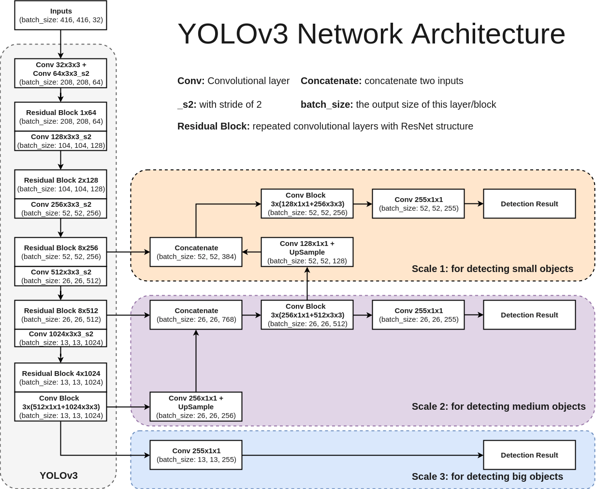

# Understanding Yolo model and its variants

#### Yolo V2

* Paper: https://arxiv.org/abs/1612.08242v1

* Classification (Recognition): To identify cat vs dog; classify the object

* Detection: Bounding box along with classification; where the object is

* Compared to V1: BatchNorm, Skip connection, Fully convolutional, High res classifier/detector etc

* Uses anchor boxes: Anchor box are set of fixed size boxes which are scaled to fit object in it. After scaling the anchor box for the object, the final box is called bounding box

* Strategy used to train faster:
  * Start with low res, for example if you are high res images are of 448x448 dims, then you start training with 56x56 i.e. scale down the image and then train. This will be 64 times faster!! (448/56 * 448/56)
  * With initial low res training, we train initial layers for E/G/T/P
  * Because the network is fully convolutionally, we can input images of different dimensions
  * We already saw that we divide the image dims by its own dim, essentially making all the values between 0-1. This way Yolo will work on **proportions** rather than actual sizes. This way find clusters of anchor boxes of same proportions using k-means clustering.
  * Output is 13x13x5x25:
    * Image is divided into 13x13 blocks. Each block's top-left corner coordinate is (0,0) & bottom-right coordinate is (1,1)
    * 5 = 5 anchor boxes
    * 25 = 5 + 20:
      * 5 = 4 + 1 = x,y,h,w + o
        * x,y = centroid of bounding box (will be between 0-1), sigmoid is used here
        * h,w = scaling factor of bounding box. Say anchor box dim is h1,w2, and ground truth can be close to achor box dim or very big. Hence h,w is used to get ground truth dim by using exponential func: `h1.e^h`, `w1.e^w`
        * o = objectness (is object present or not) ranges between 0-1. We choose only those which has o above a certain threshold
      * 20 = 20 classes
      
      
  * Anchor dimensions are picked using k-means clustering on the dimensions of original bounding boxes. Final anchor boxes are: (0.57273, 0.677385), (1.87446, 2.06253), (3.33843, 5.47434), (7.88282, 3.52778), (9.77052, 9.16828). What are these values?
    * This is of the ratio 13:13 i.e. divide the image into 13x13 block and above is the dimension on that 13x13 coordinate system
    * Above is for 224x244 resolution. If the dimension is different, then network might not end with 13x13. For example, in YOT, final output is 26x26. Hence these values will change.
  * If the cell is offset from the top left corner of the image by cx, cy and the bounding box ground-truth/prior has width and height gw, gh then the predictions correspond to:
    - bx = σ(tx) + cx, where σ is sigmoid
    - by = σ(ty) + cy
    - bw = gw.e^tw
    - bh = gh.e^th
  * 13x13 will work for large resolution. But what about small resolution? For this they add a skip connection (passthrough) from 26x26 resolution layer to semi last layer:
    

    * Above, we can see that in pass through, in dim is 26x26x256 and out is 13x13x2048? How did that happen?
      
      * 26x26x256 ---reshape---> 13x13x1024 ----conv---> 1x1x1024x2048 -> 13x13x2048
      
    * And below passthrough, calculation is given, where output is 13x13x1024

    * Both are stacked and we get 13x13x3072

    * The pass-through layer concatenates the higher resolution features with the low-resolution features by stacking adjacent features into different channels

    * Every 10 batches, the network chooses a random new image dimension size (multiples of 32) from 320x320 to 608x608. The anchor box dimensions will also need to scale up/down respectively.

    * The final model, called Darknet-19 has 19 convolution layers and 5 max-pooling layers. 1x1 convolutions are used to compress the feature representations between 3x3.

    * The network is first trained on classification for 160 epochs.

    * After classification training, the last convolution layer is removed, and three 3x3 convolution layers with 1024 filters each followed by the final 1x1 convolution layer are added. The network is again trained for 160 epochs.

    * During training both, detection and classification datasets are mixed. When the network sees an image with detection label, full back-propagation is performed, else only the classification part is back-propagated.

    * DarkNet-19:
      
      
      * This table is designed to start at 224. If it starts at 416, it would end at 13x13.
      
    * Loss Function:

      

      * We need to compute losses for each Anchor Box (5 in total): ∑B represents this part.

      * We need to do this for each of the 13x13 cells where S = 13: ∑S2 represents this part.

      * pij => Classes

      * Cij is also objectness, but that is used here to train the network to predict Cij

      * 1ijobj is 1 when there is an object in the cell ii, else 0.

      * 1ijnoobj is 1 when there is no object in the cell ii, else 0. We need to do this to make sure we reduce confidence when there is no object as well.

      * 1iobj is 1 when there is a particular class is predicted, else 0.

      * λs are constants. λ is highest for coordinates in order to focus more on detection (remember, we have already trained the network for recognition!)

      * We can also notice that wi, hi  are under square-root. This is done to penalise the smaller bounding boxes as we need to adjust them more.

      * Check out this table:

        | var1   | var2  | (var1-var2)^2 | (sqrtvar1-sqrtvar2)^2 |
        | ------ | ----- | ------------- | --------------------- |
        | 0.0300 | 0.020 | 9.99e-05      | 0.001                 |
        | 0.0330 | 0.022 | 0.00012       | 0.0011                |
        | 0.0693 | 0.046 | 0.000533      | 0.00233               |
        | 0.2148 | 0.143 | 0.00512       | 0.00723               |
        | 0.8808 | 0.587 | 0.0862        | 0.0296                |
        | 4.4920 | 2.994 | 2.2421        | 0.1512                |

      * For first 160 epochs, Lambda(coord) is set to 0, and then once it is trained for classification, we train it for detection

#### YOLO V3

* In YOLO-V2, they added passthrough and did stacking to support smaller resolution. Here, stacking is taken to next level
  

* Feature extractor here is ResNET

* V3 uses only Convolutional layers, not even the pooling layer! How can we avoid any pooling layer?

  * A 3x3 with a stride of 2.

  * If we start at 416 and end at 13, we have taken a total stride of 32 (416/13).

  * COCO Dataset has 80 classes. So final output shall be: 13x13x**3**x(4+1+**80**) = 13x13x**255**

  * YoloV3 has **3** Anchor Boxes! or **9?**

    * 3 Anchor boxes for the resolutions: 52x52, 26x26, 13x13 -> So in total 9 Anchor boxes i.e. 3 anchor boxes in different scales!

    

    * As seen above, no pooling layers, dim reduction is done using convolution layer with stride=2

    * Starting from Scale-3: Post convolution, output size is 13x13x255

    * At Scale-2, here's the flow:

      * 13x13x1024 ----[conv 1x1x256]--->13x13x256----[upsample]---->26x26x256------>[concat with 26x26x512]---->26x26x768---[multi-convs]--->26x26x512---[conv 1x1x255]----->26x26x255

    * At Scale-3, here's the flow:

      * 52x52x256----[concat 52x52x128]--->52x52x384---[multi-convs]---->52x52x256---[conv 1x1x255]--->52x52x255

    * Upsampling is done as shown below:
      

      

    * Class Confidence:
      * YoloV3 has an interesting take on Class probabilities. Normally you'd take a SoftMax of the output vector. This is based on the assumption that classes are mutually exclusive. *If it is a **Dog***, it cannot be a **Cat**!
      * YOLOv3 asks a question, what if we have classes which are not mutually exclusive. If it is a ***Person***, it may be a ***Man*** as well! So instead of SoftMax, v3 uses a sigmoid function.
      * v3 makes predictions at 52x52, 26x26 and 13x13; alternatively, at **strides of 8 (416/52), 16 (416/26) and 32 (416/13).**
        
      * v3 in total now predicts (52x52 + 26x26 + 13x13)*3 = **10647** bounding boxes 
      * Output processing:
        * **Object Confidence Threshold**: We filter the boxes based on their objectness score. Say we only consider those boxes which have a value greater than some threshold
        * Get all the proposed anchor boxes for a class
        * Calculate (NMS) **Non-maximum Suppression**: A technique that helps selects the best bunding box among overlapping proposals
          
          * Say there are 4 anchors boxes for a class: C1, C2, C3, C4
          * Calculate the IOU amongst those boxes i.e C1's against C2,C3,C4. Similarly, C2's against C1,C3,C4 etc. Only consider boxes which has overlap (IOU) value above some threshold (say 40%) i.e. if anchor box is less than threshold, then the box will be of 2 different objects of same class (for example, two cars in same image)
          * Group the achor boxes with IOU more than a threshold and only keep the anchor box with maximum confidence (i.e. found max features) and suppress (ignore) others
        * NMS fails if there is too much overlap between two objects of same class. For example:
          

#### YOLO V5

* YOLOv4 has improved again in terms of accuracy (average precision) and speed (FPS), the two metrics we generally use to qualify an object detection algorithm.

* There are **4 apparent blocks, after the input image:**

  - Backbone
  - Neck
  - Dense Prediction—used in one-stage-detection algorithms such as YOLO, SSD, etc
  - Sparse Prediction—used in two-stage-detection algorithms such as Faster-R-CNN, etc.

* Backbone: **Cross-Stage-Partial connections.** The idea here is to separate the current layer into 2 parts, one that will go through a block of convolutions, and one that won’t. Then, we aggregate the results. Here’s an example with DenseNet:
  

* Neck: The purpose of the neck block is to **add extra layers between the backbone and the head (dense prediction block)**. You might see that different feature maps from the different layers used.

  

* YoloV4 used a modified version of the [PANet (Path Aggregation Network)](https://arxiv.org/pdf/1803.01534.pdf). The idea is again to aggregate information to get higher accuracy. Rather than addition, it does concatenation

* Another technique used is [Spatial Attention Module (SAM) (Links to an external site.)](https://arxiv.org/pdf/1807.06521.pdf). Attention mechanisms have been widely used in deep learning, and especially in recurrent neural networks. It is like SENet (Squeeze-Excitation Network)

  

  

* Finally, [Spatial Pyramid Pooling (SPP)](https://arxiv.org/pdf/1406.4729.pdf), used in R-CNN networks and numerous other algorithms, is also used here.

  

