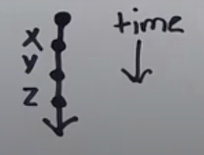
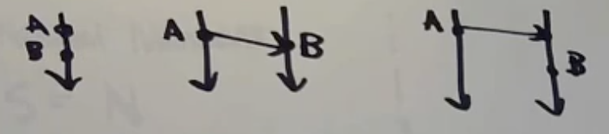
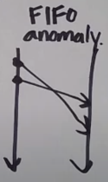
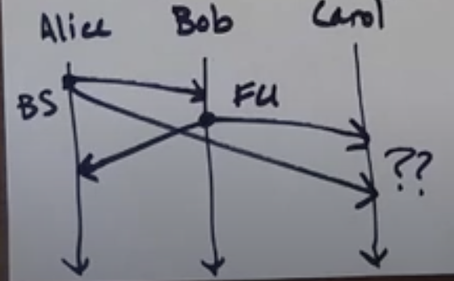
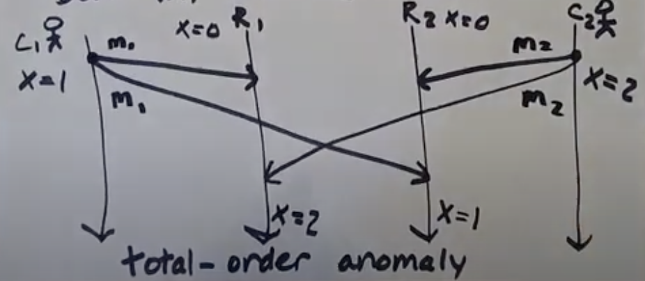
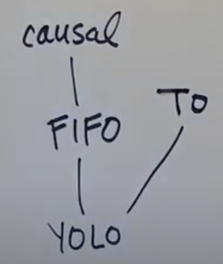
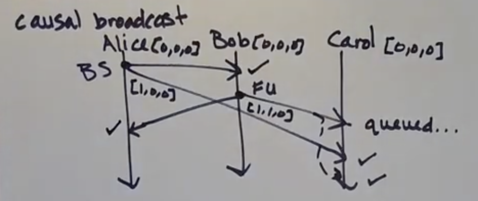
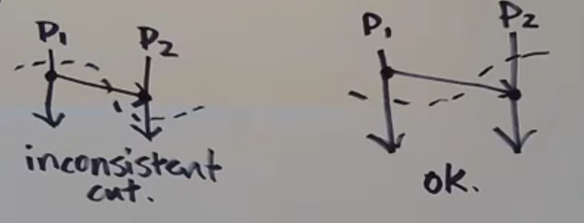
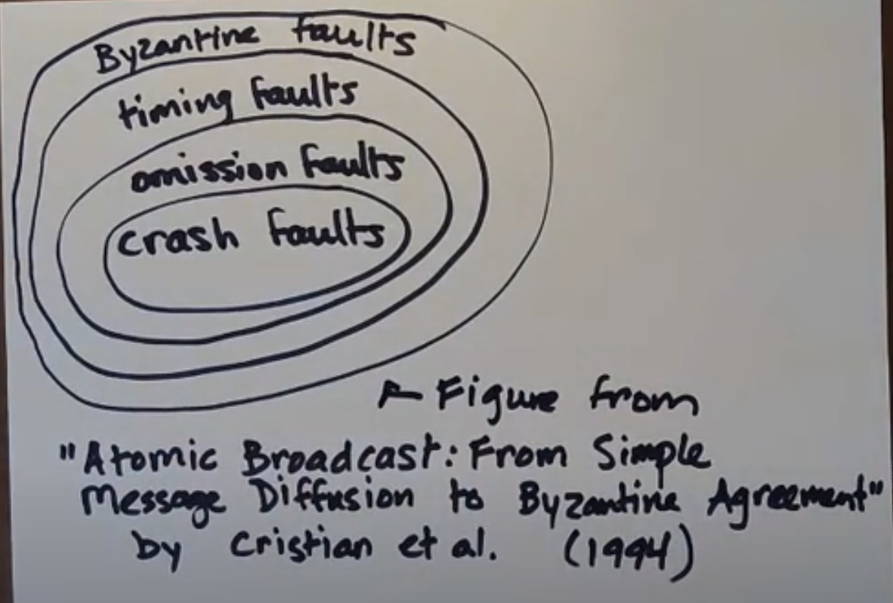
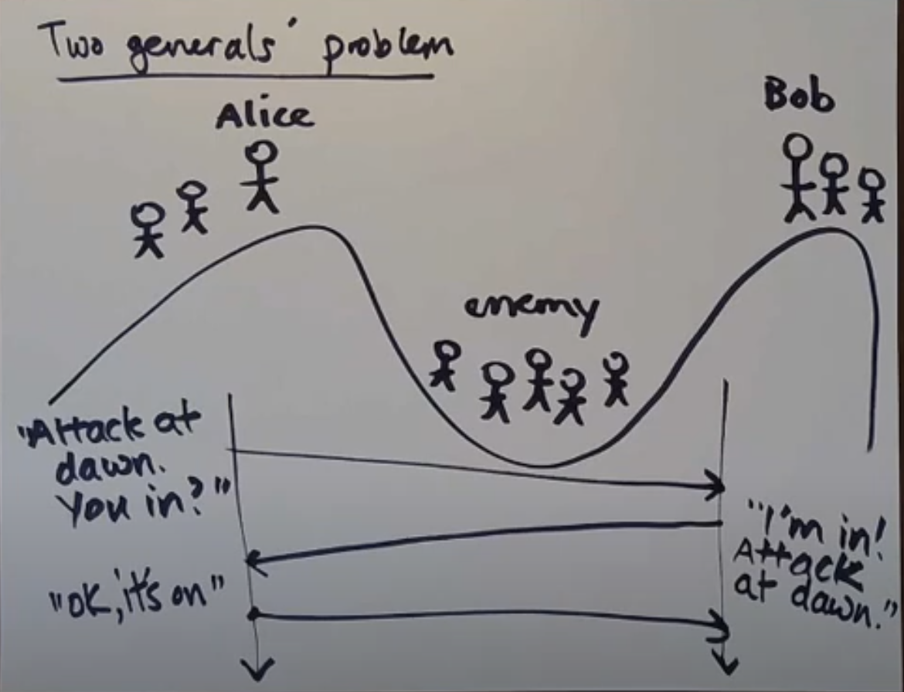

## Notes on Distributed Systems

### Course Details:

CSE138, Lecture on Youtube: https://www.youtube.com/playlist?list=PLNPUF5QyWU8O0Wd8QDh9KaM1ggsxspJ31 by Professor Lindsey Kuper, UC Santa Cruz

### What & Why?

##### What is a distributed system?

* Martin Kelppmann's definition:
  * running on several nodes connected by a network
  * characterized by partial failures

* Different philosophies on dealing with failures:

  |                       Cloud Computing                        |               High Performance Computing (HPC)               |
  | :----------------------------------------------------------: | :----------------------------------------------------------: |
  | Working around partial failures & expecting those kinds of failures |          Treat potential failures as total failures          |
  |                                                              | Performs checkpointing (if a problem occurs, then you rollback to your last checkpoint) |

##### Ways of failures:

  * Machines itself failing
  * Connection between machines failing

* Sample situations of failure. Say there are two machines m1 & m2 and m1 sends message to m2 and m2 performs some computation replies back to m1

  * Request from m1 gets lost
  * Request from m1 is slow
  * m1 sends message and message reaches m2, but then m2 crashes

  In above situations, even though they are different from each other, from m1's point of view they are indistinguishable. Now consider the following situations:

  * m1 sends message, but m2 is slow
  * m2 replies message, but it takes lot of time for the message to reach m1
  * m2 replies message, but it gets lost

  Again from m1's point of view, all these situtations are indistinguishable

* Hence, If you send a request to another node and don't receive a response, it is **impossible** to know whey (without global knowledge of the system)

* Some other situations that could occur (Byzantine faults):
  * m2's lying, refusing to answer
  * cosmic rays

* How can m1 deal with all these uncertainities? One way is to set **timeouts**. Post timeout assume failure. But then consider this scenario:
  * m1 sends request to m2 to increment x
  * m2 increments x, and replies "OK" to m1
  * But say m1 doesn't receive "OK". Then it'll be wrong to assume that increment didn't occur and it'll be wrong to assume that increment did occur. This kind of **uncertainity** is the **fundamental characteristic of a distributed system and is inevitable**

* A distributed system is characterised by partial failure and unbounded latency

* Why would you want a distributed system?
  * data too big to fit on one machine
  * to make things faster

### Time and clocks

* Clocks are used to

  1. mark **points** in time. Ex: "This class starts at 9 AM PDT"
  2. measuring durations or intervals of time. Ex: "This class is 60min long"

* Computers have `time-of-day` clocks & `monotonic`

  | time-of-day clocks |           monotonic clocks            |
  | :----------------: | :-----------------------------------: |
  |  sync'd with NTP   | only go forward, some kind of counter |
  |   Ok-ish for (1)   |              bad for (1)              |
  |    bad for (2)     |             good for (2)              |

* `monotonic` clocks are preferred for distributed systems. There is an interesting cloudflare issue as they were using `time-of-day` clocks for calculating timeouts: https://blog.cloudflare.com/how-and-why-the-leap-second-affected-cloudflare-dns/

* But what's the good way to mark points in time? There is really no good way with **physical** clocks

* Both of the above clocks are **physical clocks**. But in distributed systems, we just can't get away with just having physical clocks. We need a different notion of clock, which is called **logical clocks**

|        physical clocks         |           logical clocks            |
| :----------------------------: | :---------------------------------: |
| time-of-day & monotonic clocks |   only measure ordering of events   |
|                                | which event happened before another |

* Suppose A happened before B (A -> B), then we can say that:
  * A could have caused B
  * B could not have caused A
* This reasoning is good for:
  * debugging (possible causes of a bug)
  * designing systems

### Lamport Diagrams

* AKA Space-time diagrams
* Process is a line with a discrete beginning that goes on forever and events are dots on that line and time goes forward. It also represents causality:

  

  * X, Y, Z are events
  * X happened before Y, Y happened before Z

### Happens-Before Relation

* Consider three machines M0, M1, M2. Because these machines don't share memory, they communicate by sending messages to each other. Message send and receive are also events:

  

  * Say P is a message sent event & S is a message receive event
  * X, Y, Z are internal events

* From above diagram, we can come up with a general definition for `->` (**happens-before relation**):
  Given two events A & B, we say `A -> B` ("A happened before B"), if any of the following is true:

  * A and B occur on the same process line with B after A
  * A is a message send event and B is the corresponding receive
  * if `A -> C`, and `C -> B`, then `A -> B`  (trransitive closure)

* So we can summarize happens-before relation by using lamport diagram:

  

* From above example, we can say `P -> Y`

* Let's looks at some more examples:

  

  From above we can say that:

  * P & S, X & Z, P & Z are related by happens-before relation
  * But Q & R are not related. We cannot say if Q happened before R or vice-versa. This case is called **concurrent or independent**. And is represented like this: `Q || R`

###Causal Anomaly

Consider this lamport diagram:

* Alice sends message to both Bob & Carol: "Bob Smells"
* Bob receives that message and then send `FU` to both Alice & Carol
* Carol wonders why she received this message ?? This is what is known as **causal anomaly**
* We can use the concept of **happens-before** to rule out such anomalies

### Network Models

* Causal nomalies could occur because of unbounded latency. It would really be helpful if we knew some fixed amount of time that it took for a message to get from Alice to intended recepient. Such kind of network where we know how much time it takes for a message to get where it gets is called a **synchronous network**. To be precise, A synchronous network is one wherre there exist an `n` such that no message takes longer than `n` units of time to be delivered.
* There exists another network model called an **asynchronous network**. An asynchronous network is one where there exists no such `n`
* But what is a model? A model is a set of assumptions that you use to build a system. Those assumptions might be more or less realistic

### State And Events

* A state of a machine is the content of its memory and register at a particular instance of time. But we can also say that an event is a state because whatever is the contents of the memory, it is going to be completely determined by all the events that have happened up until then. So by going through the sequence of events, we can determine the state of the machine.

### Partial Orders

* Happens-before relation is a particular kind of relation, called a partial order. It's actually a special kind of partial order
* **Definition**: Partial orders are actually two things glued to each other:
  * a set `S`, together with ...
  * a binary relation, usually, but not always, written $\leq$,  that lets you compare things from `S`, and has these properties:
    * Reflexivity: $\forall$ a $\in$ S, a $\leq$ a
    * Anti-Symmetry: $\forall$ a, b $\in$ s, if a $\leq$ b and b $\leq$ a, then a = b
    * Transitivity: $\forall$ a, b, c $\in$ S, if a $\leq$ b and b $\leq$ c, then a $\leq$ c
* But happens-before relation is little weird:
  * Reflexivity: Events donot follow reflexivity. We cannot say an event `A` is $\leq$ event `A` i.e. an event `A` happens before itself
  * Anti-Symmetry: Works for happens-before because there will never be a case where an event `A` happens before `B` and simultaneously `B` happens before `A`. Hence it is *vacuously* true
  * Transitivity: Checks out for happens-before. It is already part of happens-before's definition
* Hence **happens-before** relation is called **irreflexive partial order**. It is not a   real partial order
* Example of a real partial order: set inclusion {a, b, c}
  * All subsets S = {$\phi$, {a}, {b}, {c}, {a, b}, {a, c}, {b, c}, {a, b, c}}
  * Follows Reflexive: {a} $\leq$ {a}, Yes. `a` is a subset of `a`
  * Follows Anti-symmetry
  * Follows Transitivity
* In partial order, every element is not related to every other element. And hence it is called partial order. A **total order** is where every element is comparable/related to every other element. For example, Natural numbers.

### Lamport Clocks

* It is a simplest kind of logical clock, denotated by `LC(<event>)`

* If `A -> B`, then `LC(A) < LC(B)`. **Lamport clocks are consistent with causality**

* Algorithm to assigning LCs to events:

  1. Every process has a counter, initially 0

  2. On every event, a process increments its counter

  3. When sending a message, a process includes its current counter along with the message
  4. When receiving a message, set your counter to `max(local_counter, message_counter) + 1`. Plus 1 is only if we consider message receive as an event

     

* As seen above, LC for process P1 started with 0, then changed to 1 and then to 4, 5, 7 due to message communication with other processes. Note counter is sent as part of metadata

* We know that if `A -> B`, then `LC(A) < LC(B)`. But if `LC(A) < LC(B)`, do we know if `A -> B`? No! As seen in above diagram, A and B are on different process lines and A had no communication with B. Hence we can say that **LCs do not characterize causality**

* We can say that `A -> B` only if A can reach B via some path. For example, `P2(6)` can be reached from `P2(1)` via this path `P2(1) to P3(2) to P3(3) to P3(4) to P2(5) to P2(6)`. Hence we can say that **causality is graph reachability in spacetime**

* Reference: Schwartz & Mattern (1994): "Detecting causal relationships in distributed systemcs: In search of the Holy Grail"

* Then what are LCs used for? let's take contrapositive of above LC-Causality Equation:
  if $\neg$ (LC(A) < LC(B)), then $\neg$(A -> B)

  * In other words, if LC(A) is not less than LC(B), then we know that A did not happen before B
  * That's what LCs can be used for! They can rule out things as not having caused other things. That is really valuable. It helps us in debugging

### Vector Clocks

* As seen above, LCs do not characterize causality. This is where vector clocks come in. **VCs are consistent with causality and characterize causality**

* A vector clock (VC) is just a sequence of integers

  1. Every process maintains a vector of integers initialized to 0, one for each process
  2. On every event, a process increments its own position in its vector clock
  3. When sending a message, each process includes its current clock (after incrementing)
  4. When receiving a message, each process updates its VC to the **max** of the received VC and its own (after incrementing). Max is pointwise/elementwise maximum: Say there are two VCs: `[1, 12, 4]`  & `[7, 0, 2]`. Then pointwise max is `[7, 12, 4]`

* So following is true for VC:
  A -> B $\iff$ VC(A) < VC(B)

* But then how do we compare to VCs?

  VC(A) < VC(B), when if for every index (i), VC(A)i $\leq$ VC(B)i and VC(A) $\ne$ VC(B). Examples:

  * VC(A) = [2, 2, 0] & VC(B) = [3, 2, 0]
    * here VC(A) < VC(B)
  * VC(A) = [2, 2, 0] & VC(B) = [1, 2, 3]
    * here VC(A) $\nless$ VC(B)
    * Also, VC(B) $\nless$ VC(A).
    * In this case, they are called **concurrent** or **independent**: `VC(A) || VC(B)`

* Let's look at lamport diagram:

  

  * As seen above, vector clocks start with [0, 0, 0] for each process. Each index is a process, so from above example VC: [<Alice-count>, <Bob-count>, <Carol-count>]
  * As we know causality is graph reachability in spacetime, this can be seen above where all the encircled VCs can reach event A
  * Also, we can also notice that VCs of all the events above A is < VC(A)
  * A and B are independent (concurrent), we can also say that they are causally unrelated. This is great! But just comparing numbers (vectors), computers can figure out if two events are causally related

### Protocols

* A set of rules that computers use to communicate with each other
* A lamport diagram can describe a protocol run, but it cannot describe a protocol as there can be infinite runs of a protocol. But it can describe a violation of the protocol

###Message Delivery

* Receving vs Delivery of messages:
  * Sending a message is something you do
  * Receiving a message is something that happens to you (you don't control)
  * Delivering a message is something you do (for example: protocol can queue up message before delivering it to process)
* An anomaly is a run that violates the property that we want to have to be true

#### FIFO Delivery

* Consider **FIFO delivery**. If a process sends message M2 after message M1, **<u>any process delivering both</u>**, delivers M1 first.
  Here's how a FIFO anomaly will looks like:

  

  * As seen above, two messages are delivered to same process, but since the order is changed, it is a FIFO violation (anomaly)

#### Causal Delivery

* There is also **causal delivery**. If M1's send happens before M2's send, then M1's delivery happens before M2's delivery

* FIFO violation is also causal delivery violation

  

  * Above is not a FIFO violation as no process is delivering both the messages from same origin process, infact they are not at all receiving two message from same proccess
  * But it is a causal delivery violation, as seen above Alice sends message to Carol before Bob sends it to Carol. But Bob's message is received first.

#### Totally Ordered Delivery

* If a process delivers message M1, then M2, then **<u>all</u>** processes delivering both M1 and M2 delivers M1 first

  

  * Consider two clients (C1, C2) and two replica keystores (R1, R2)
  * C1, updates value of X to 1 and then to 2. And C2, updates value of X to 2 and then to 1
  * This is total-order anomaly. Same messages were delivered in different order by C1 & C2
  * In below chart, FIFO anomaly is not a violation of totally ordered delivery, as there is only single process delivering messages. Note in above definition we need more than one delivering process to know if there is TO (total order) anomaly:

    

#### Delivery guarantees

  * Guaranteeing causal delivery also guarantees FIFO delivery
  * Following is a delivery guarantee chart from bottom providing no guarantee to top being complete guarantee:

    

  * YOLO: Just symobilises on guarantee
  * Guaranteeing causal delivery guarantees FIFO delivery
  * But guaranteeing TO delivery doesn't guarantee neither FIFO nor causal delivery
  * We need some other kind of delivery which guarantees both TO & Causal delivery
  * From above heirarchy we can also deduce that if there is FIFO anomaly, then there is also Causal anomaly

###Implementing FIFO delivery

* Typical approach: <u>Sequence numbers</u> = Messages get tagged with a sequence number from the send and a sender ID
* Sender increments its sequence number (SN) after sending
* If a received message's SN is the SN+1 of the previously delivered message from that sender, deliver it! Otherwise, queue it up for later
* Above is one approach. Some issues with above approach:
  * What if message gets lost? Then all the later messages will get queued for ever. We need some sort of reliable delivery. Hence this approach assumes reliable delivery
* Another way is <u>acknowledgements</u>! Receiving process replies with ack message.

### Implementing Causal Delivery

* We can use vector clocks to rule out causal anomaly

* By only having to track message <u>sends</u>, vector clocks can rule out causal anomaly. This is the implementation for causal broadcast

  

  * As seen above, the causal anomaly is when Bob's message gets delivered before Alice's message by Carol
  * This is avoided by using VCs. Carol checks VC sent by Bob (1,1,0) against its own VC (0,0,0) and sees that Alice's index position is greater than it's local clock and hence the message queued
  * Once Carol receives Alice's VC (1,0,0) it updates its VC to (1,0,0) and then release the queued message sent by Bob
  * As seen above, it works **only for** causal broadcasts

#### Causal Broadcast Algorithm

  1. If a message sent by P1 is delivered at P2, increment P2's local clock in the P1's position
  2. If a message is sent by a process, then first increment its own position in its local clock, and include the local clock along with the message
  3. A message sent by process P1 is only delivered at P2 if:
     * VC at position P1 of incoming message is equal to VC at position P1 of P2's VC + 1 i.e P1'sVC[P1] = P2'sVC[P1] + 1. This ensures that timestamp on the message from P1 makes it the next expected message
     * and, VC at all other positions of incoming message is less than equal to VC of all other positions of P2's VC i.e P1'sVC[Pk] $\leq$ P2'sVC[Pk] for all k $\ne$1. This ensures that no missing messages from other processes

  Here's another example:

  

* Causal delivery doesn't rule out TO anomalies! As seen below causal broadcast algorithm works fine, but there is TO anomaly

  

* Hence if we need both causal delivery and TO delivery, then we need some thing other than VC to ensure both

####Uses of potential causality

Ways that potential causality (->) is used in distributed systems:

* Determine order of events after the fact (for debugging)
* Causal ordering of events as they're happening
* Consistent global snapshots. If A -> B and B is in the snapshot then A should be too. A state of a process is all the events on the process at a particular point in time. Hence a global state will be the state of all the processes at a particular point in time. But we can't rely on time-of-day clocks for this as a clock can be running in different time (timezones) on different processes. Hence, we need some algorithm to consistent take global snaphot of all the processes' state. That is Chandy-Lamport Snapshot algorithm

### Chandy-Lamport Snapshot Algorithm

* A channel is a connection from one process to another:

  * C12 : Symbolizes a channel from proccess 1 to process 2
  * C21: Symbolizes a channel from process 2 to process 1

* Channels act like FIFO queues (to prevent FIFO violations)

* Any process can start this algorithm without notifying other processes. Hence this is a <u>decentralized algorithm</u> (one that has multiple initiators)

* Another nice property of this algorithm is that it can run with the application running i.e. sending messages

* The process which starts the algorithm is called "initiator process":

  * Records its own state
  * Sends a marker message out on all its outgoing channels
  * Starts recording the messages it receives on all its incoming channels

* When process Pi gets a marker message on channel Cki (channel from Pk to Pi):

  * If it's the first marker Pi has seen:

    * Pi records its state
    * Pi marks channel Cki as <u>empty</u>
    * Pi sends a marker out on every outgoing channel Cij
    * Pi starts recording incoming messages on all its incoming channels except Cki

    TL;DR: Record your state and start recording incoming messages

  * If Pi has already seen a marker:

    * Pi stops recording on Cki, and sets Cki's final state as the sequence of all the incoming messages that arrived on Cki since recording began
    * Note: Sending a marker message is also considered as seeing a marker

* Nice [Blog](http://composition.al/blog/2019/04/26/an-example-run-of-the-chandy-lamport-snapshot-algorithm/) on example run of this algorithm. Must read and hence will not go through that explanation here!

  

* Important Note: This algorithm <u>assumes reliable delivery</u> i.e. it assumes that no messages can get lost, but they could be slow

* Number of marker messages sent are N * (N -1), since each process sends marker messages to all other processes

* So when does a process know that snapshoting is done? So it is done when it has recorded its state and the state of all its incoming channels

* But when does the whole thing terminate? When all the processes ensures the above thing

* **Assumptions/Limitations:**

  * Channels are FIFO. If channels are not FIFO, then we must pause the application to capture snapshot using Chandy-Lamport Algorithm
  * Reliable delivery of messages (messages aren't lost/corrupted/duplicated)
  * Processes don't crash while the algorithm is running (if it crashes, then we must start over)

* **Good things:**

  * If the communication graph is <u>strongly connected</u> and <u>at least one</u> process starts with recording its state then all processes will record its state in finite time assuming reliable delivery
  * Multiple processes can initiate this algorithm. If this was not the case, then it would been a problem on who should initiate this algorithm

* **What are snaphots good for ?**

  * Checkpointing
  * Deadlock detection
  * Any <u>stable property</u> (a property that, once true, remains true) detection. For example: deadlock is a stable property. Another example is "the system has finished doing useful work" i.e. termination

### Cut

* A cut is a "time frontier" going across a Lamport diagram, dividing it into "past" and "future"

  

* An event is "in the cut" if it is on the "past" side

* A cut is consistent when, for all the events E, F that are in the cut, if F-> E, then F is also in the cut

  

* The Chandy-Lamport algorithm determines a consistent cut. It will always give us a global snapshot of processes that correspond to consistent cut. Hence it is also mentioned that this algorithm is <u>causally correct</u>

### Safety - Liveness property

* **Safety Property:** Colloquially, <u>Something bad won't happen</u>. They can be violated in a finite execution
  Examples: FIFO delivery, Causal delivery, TO delivery.
* **Liveness Property:** Colloquially, <u>Something good eventually happens</u>. Cannot be violated in a finite execution
  For example: Consider a process P1, sends request to process P2. And the property is that P2 always replies to a request. Does this execution violates this property? No, unless there is a time limit on this we cannot say that it violates this property. Hence liveness property do not have finite counter examples. We can draw lot of executions that satisfy the liveness property, but we can't draw a picture of finite execution that violates it. Another example is reliable delivery. **Reliable Delivery:** Let P1 be a process that sends a message m to process P2. If neither P1 nor P2 crashes, then P2 eventually delivers m.

### Fault Models

* Models which tells which categories of faults can occur, so that we know which one to worry about
* More formally, A <u>fault model</u> is a specification that specifies what kinds of faults a system may exhibit (and thus defines what kinds of faults are to be tolerated by the system)
* Types of faults (in below order):
  * Crash fault - a process fails by halting (crashes) (stops sending or receiving any messages)
  * Omission fault - a message is lost (a process fails to send or receive a message)
  * Timing fault - a process responds too late (will not be discussed here as we will be dealing with asynchronous networks where there is no time guarantee)
  * Byzantine fault - a process behaves in an arbitrary or even malicious way
* Why hierarchy/order on faults?
  - Crash faults are a special case of omission faults where all messages to and from a process get lost after some point
  - Timing faults are a special case of ommision faults where all messages are lost infinitely
  - A process that can tolerate Byzantine faults, should be able to tolerate all other faults. The Byzantine faulty process can do anything at once including mimicking the fault behaviours that you get with those other kind of faults

* Byzantine fault tolerance is the most complicated and expensive to implement
* Byzantine faults can be further sub-divided as some Byzantine faults are easier to handle than compared to others
  * Authentication-detectable Byzantine faults: Like message corruption, we can deal with this using checksum. We can just detect the corruption and drop the message, then it becomes omission fault

#### Two Generals Problem

* An illustration of Omission model
* Say Alice and Bob are two generals on top of the hill. And for them to win over enemy, then have to attack it together. So Alice sends a messager to Bob with a message being the time of day to attack the enemy. Now there could multiple problems:
  * Messenger doesn't reach Bob
  * Messenger reaches Bob, but then Alice doesn't know that. For this Bob will have to reply back with an acknowledgement. But then that ack could get lost
  * Say Ack reaches Alice, but then Bob doesn't know that. So Alice will have to send another message and it keeps going.
* Hence we can say, In the **Omission model**, it is impossible for a general to now that the other will attack
* Workarounds:
  * Make a plan in advance (an example of <u>common knowledge</u>). We say that there's <u>common knowledge</u> of some piece of information P when:
    * everyone knows P
    * everyone knows that everyone knows P
    * everyone knows .... that everyone knows P
  * Increase Bob's confidence, by Alice sending multiple messages until it receives ack from Bob
